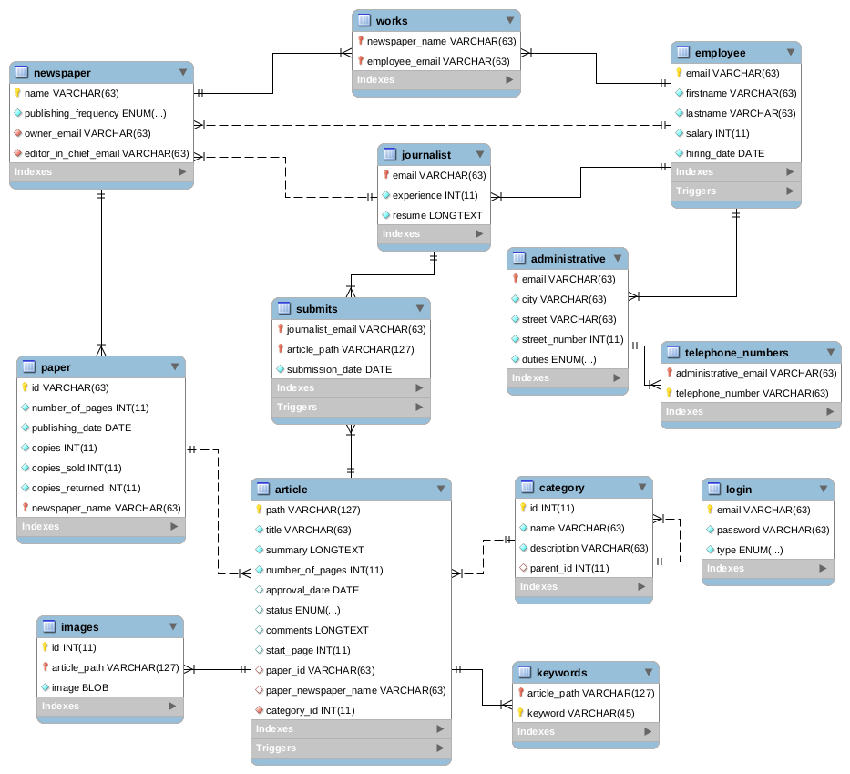
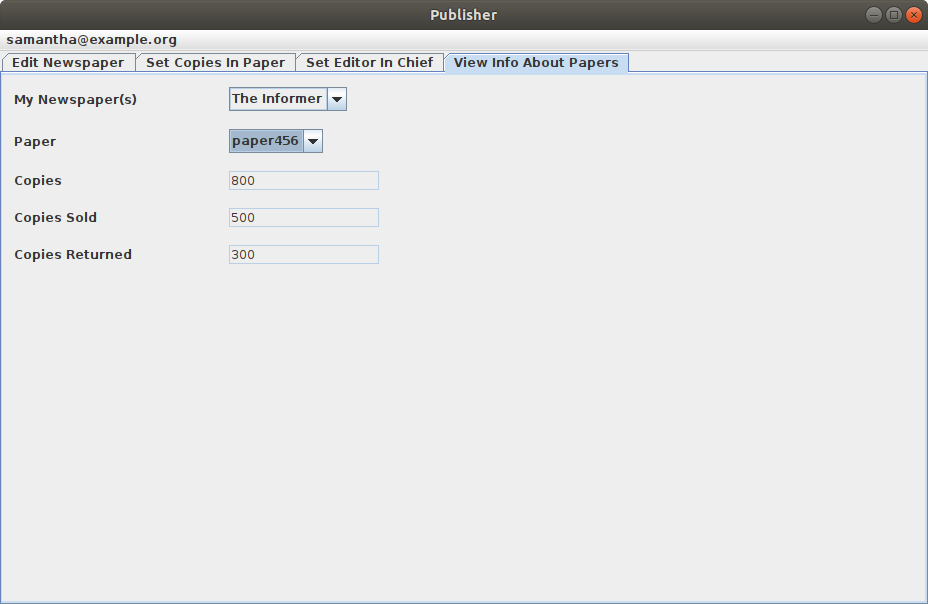
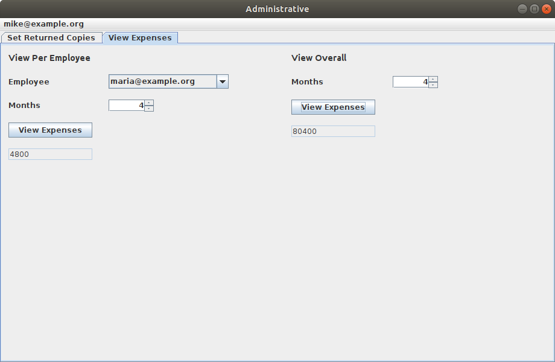
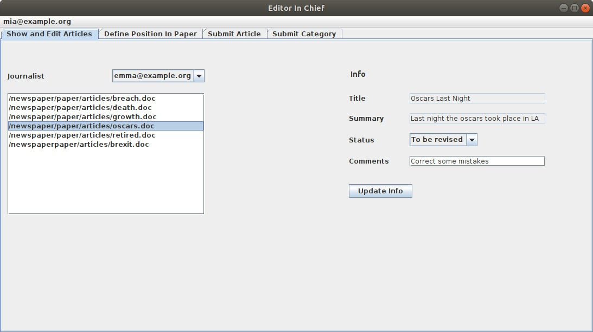
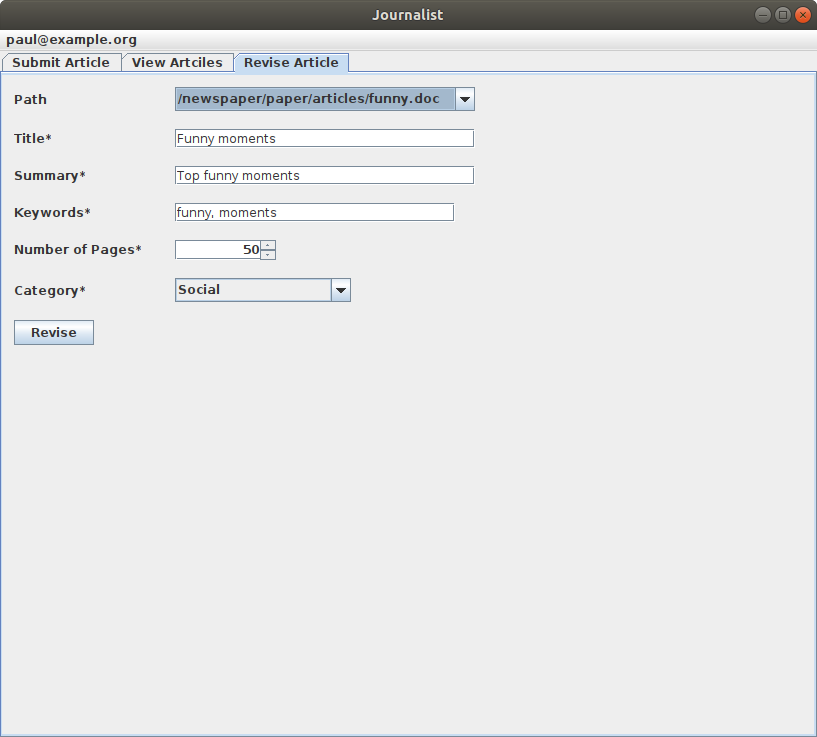

# Newspaper Database implemented in MySQL with GUI

## About The Project

This project was part of the Computer Engineering and Informatics Department (CEID) of University of Patras curriculum.

The goal of the project was to create a newspaper database in MySQL and implement a GUI in Java Swing.

## EER Diagram

## Panels

* More panels can be found [here](screenshots/).

## Technologies
- MySQL
- Java
- Java Swing
- JDBC

## Tools
- MySQL Workbench
- Netbeans IDE
